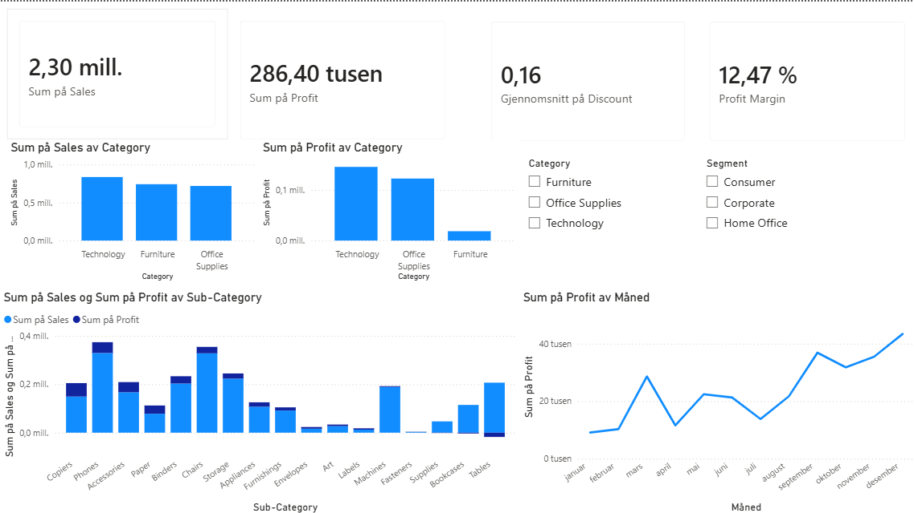

# Retail Sales & Profitability Analysis
## Project Overview

This project analyzes retail sales and profitability data using Excel and Power BI.

The dashboard focuses on:
- Sales performance
- Profitability analysis
- Profit margin
- Product category performance
- Monthly profit trends
- Sub-category comparison

The goal of the project is to identify which categories and products generate the highest sales and profit, and to uncover low-margin areas that may require business attention.

## Dashboard Preview



## Tools Used

- Excel
- Power BI
- DAX
- Data Visualization

## DAX Calculation

```DAX
Profit Margin = DIVIDE(SUM(Orders[Profit]), SUM(Orders[Sales]))
```

## Key Insights

- Technology generated the highest sales and profit.
- Furniture showed significantly lower profit margins compared to other categories.
- Profit increased toward the end of the year.
- Some sub-categories generated strong sales but relatively low profit.

## Business Recommendations

- Investigate low-margin furniture products.
- Focus marketing efforts on high-performing technology products.
- Review discount strategy for low-profit categories.
- Optimize underperforming sub-categories.
