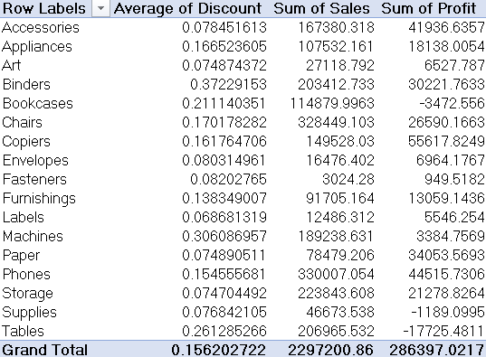
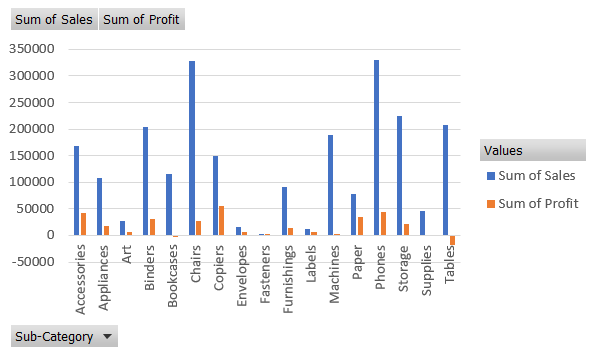
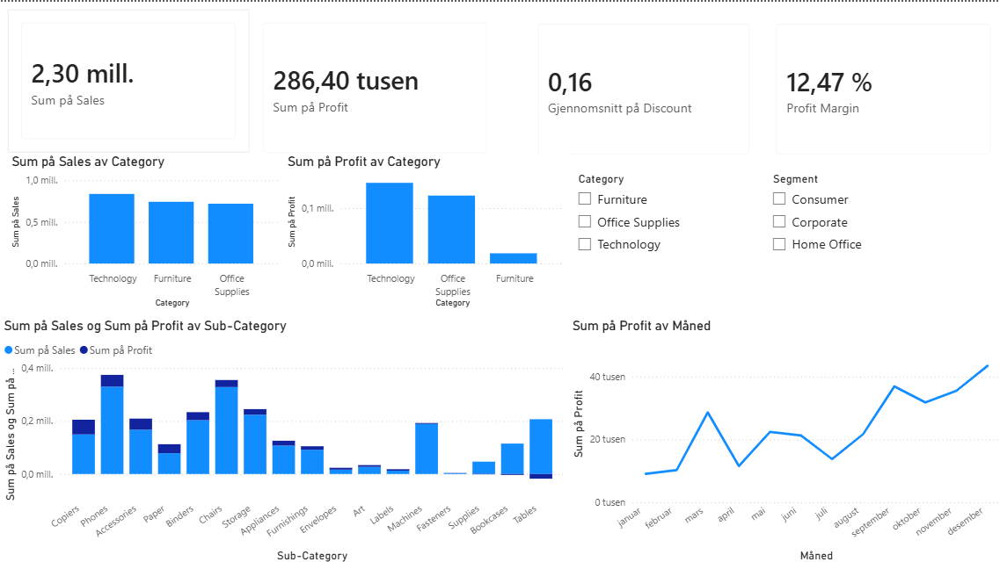

# Retail Sales & Profitability Analysis

**Excel | Power BI | DAX | Business Analysis**

This project analyzes retail sales and profitability to identify which product categories generate strong revenue and which areas reduce overall profitability.

The main objective is to understand whether high sales also translate into strong profit and to identify underperforming product groups that may require further investigation.

## Business Questions

The analysis focuses on four questions:

- Which categories generate the highest sales and profit?
- Which sub-categories underperform despite generating sales?
- Where are negative-profit areas concentrated?
- Which areas should be investigated to improve profitability?

## Data and Method

The project uses the **Sample Superstore** retail dataset.

The analysis was first explored in Excel using Pivot Tables to compare:

- Sales
- Profit
- Average discount
- Category and sub-category performance

The results were then visualized and analyzed further in Power BI.

## Excel Analysis

The Excel analysis was used to identify differences in sales, profit and discounts across product sub-categories.

### Excel Pivot Analysis



The analysis showed that performance varies substantially between sub-categories. Some products generate strong sales while contributing relatively little profit, and some sub-categories generate negative profit.

### Excel Visualization



The comparison between sales and profit makes it easier to identify product groups where high revenue does not translate into strong profitability.

## Dashboard



The Power BI dashboard summarizes overall performance and allows comparison across categories, sub-categories and customer segments.

### Overall Performance

- Total sales: approximately **2.30M**
- Total profit: approximately **286.4K**
- Overall profit margin: **12.47%**
- Average discount: approximately **16%**

## Key Findings

### Technology leads in sales and profit

Technology generated the highest sales and profit among the three main product categories.

This indicates that strong revenue in this category also translates into relatively strong profitability.

### Furniture generates strong sales but weak profit

Furniture generated substantial sales but considerably less profit than Technology and Office Supplies.

Looking deeper at the sub-category level shows that the profitability problem is concentrated in specific product groups rather than being equally distributed across the entire category.

### Some sub-categories generate negative profit

The analysis identified negative-profit sub-categories, particularly **Tables** and **Bookcases**.

This demonstrates why sales alone are not sufficient for evaluating product performance. A product group can generate meaningful revenue while still reducing overall profitability.

## DAX Calculation

Profit margin was calculated in Power BI using:

```DAX
Profit Margin =
DIVIDE(
    SUM(Orders[Profit]),
    SUM(Orders[Sales])
)
```

This produced an overall profit margin of approximately **12.47%**.

## Business Recommendations

Based on the analysis, the business should prioritize investigating the profitability of underperforming product groups.

Potential next steps include:

- Review pricing and cost structure for Tables and Bookcases
- Investigate whether discount levels are associated with lower profitability
- Identify individual products responsible for the largest losses
- Protect strong-performing categories while improving margins in weaker product groups

The analysis identifies **where** profitability problems occur, but does not establish their exact causes. Further analysis would be required before making major pricing or discount decisions.

## Limitations

The project uses the Sample Superstore dataset and should therefore be treated as an analytical portfolio case rather than a representation of a real company's performance.

The analysis identifies relationships between sales, discounts and profitability, but does not establish that discounts directly cause lower profit.

Additional information such as product costs, marketing costs and operational expenses would allow for a more complete profitability analysis.

## Tools and Skills

- Excel
- Pivot Tables
- Power BI
- DAX
- Profitability Analysis
- Data Visualization
- Business Analysis

## Files Included

- `Superstore.xlsx` — Dataset used for the analysis
- `Retail_Sales_Profitability_Analysis.pbix` — Power BI dashboard file
- `dashboard_overview.png` — Dashboard preview
- `excel_subcategory_analysis.png` — Excel pivot analysis
- `excel_chart_analysis.png` — Excel chart analysis
